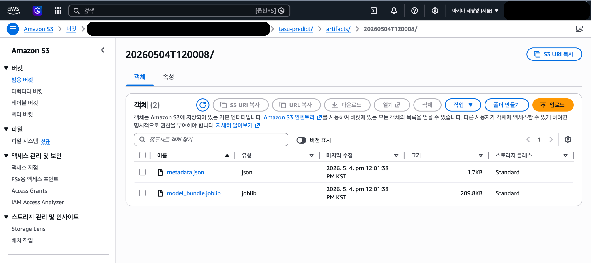

# Tasu Prediction Model Lambda

> Korean version: [README_Kver.md](./README_Kver.md)

## Item-Level Service-Time Prediction Training Pipeline for ETA Calculation

This Lambda trains a model that predicts `tasu`, which represents the service time required to process one delivery item.  
The model is used by the ETA Calculation Lambda, and the training pipeline periodically stores model bundles and metadata in S3 as a lightweight serverless MLOps pipeline.

> In this project, `tasu` is not simple travel time. It refers to the time required to process one item after traveling from one stop to the next.  
> It is used to complement the time that cannot be explained by OSRM travel time alone, such as stopping, unloading, item checking, and delivery handling.

---

## Executive Impact

| Area | Before | After |
|---|---|---|
| ETA service time | Fixed value / simple average | ML prediction based on area, weekday, and hour |
| Model management | Manual file management | S3 artifact versioning |
| Latest model reference | Direct path required | `latest.json` pointer |
| Operation method | One-off training | EventBridge-based daily training |

---

## Business Problem

Delivery ETA cannot be accurately calculated using travel time alone.  
In real delivery operations, additional service time occurs after travel.

Examples include:

- Parking / stopping
- Unloading
- Item checking
- Moving through entrance or elevator
- Handing off the item to the recipient
- Processing multiple items at the same address

This service time varies by region, weekday, time of day, and delivery pattern. Using a fixed value can increase ETA error.

---

## My Role

- Defined the service-time target used for ETA calculation
- Built the training dataset from recent completed delivery history
- Implemented feature engineering based on area, weekday, and hour
- Implemented LightGBM regression model training pipeline
- Designed S3 artifact versioning structure for model bundle, metadata, and latest pointer
- Designed the integration structure so that ETA Lambda can load the latest model

---

## Key Features

### 1. Daily Batch Training

- Runs automatically at a scheduled time through EventBridge
- Builds training dataset from recent N-day completed delivery history
- Saves model bundle and training metadata to S3

### 2. Tasu Prediction Model

The model predicts item-level service time using the following features.

| Feature | Description |
|---|---|
| `Area` | Region group derived from area code |
| `weekday` | Weekday based on delivery completion time |
| `hour` | Hour of delivery completion |
| `avg_time_per_sector_block` | Average service time by area and time block |

### 3. Artifact Versioning

Each training run saves model artifacts under a timestamp-based version directory.

```text
s3://<model-bucket>/tasu-predict/artifacts/{model_version}/
├── model_bundle.joblib
└── metadata.json
```

### 4. Latest Pointer

`latest.json` is stored separately so that ETA Lambda can always load the latest model.

```text
s3://<model-bucket>/tasu-predict/latest.json
```

---

## Architecture

```text
EventBridge Schedule
        ↓
Tasu Predict Train Lambda
        ↓
Training Dataset Query
        ↓
Preprocessing / Feature Engineering
        ↓
LightGBM Model Training
        ↓
S3 Model Artifact Save
        ↓
latest.json Update
        ↓
ETA Calculate Lambda loads latest model
```

---

## Model Logic

### Target

```text
target_tasu = time difference in minutes between previous_delivery_complete_time and current_delivery_complete_time
```

This approximates the time required to travel from one stop to the next and process one delivery item.

### Filtering

- Use only completed delivery records
- Exclude abnormal status data
- Exclude non-positive or extremely long service-time values
- Use only operational time windows
- Train mainly on the Q2 to Q3 range to reduce the influence of extreme outliers

---

## S3 Artifact Structure



| File | Description |
|---|---|
| `model_bundle.joblib` | Trained model, feature list, categorical feature list, and fallback tables |
| `metadata.json` | Model version, training timestamp, dataset summary, performance metrics, and S3 key information |
| `latest.json` | Pointer file used by ETA Lambda to locate the latest model |

---

## Training Output Example

```json
{
  "success": true,
  "model_version": "20260504T120008",
  "model_key": "tasu-predict/artifacts/20260504T120008/model_bundle.joblib",
  "metadata_key": "tasu-predict/artifacts/20260504T120008/metadata.json",
  "latest_key": "tasu-predict/latest.json",
  "metrics": {
    "test_rmse": 1.01,
    "test_mae": 0.72,
    "test_mape": 13.5,
    "test_r2": 0.83
  }
}
```

---

## Integration with ETA Lambda

This model is not a standalone service. It is an upstream model for the ETA calculation system.

```text
Tasu Predict Model Lambda
        ↓
S3 latest.json
        ↓
ETA Calculate Lambda
        ↓
DynamoDB
        ↓
TMS
```

ETA Calculate Lambda reads `latest.json` from S3, loads the latest `model_bundle.joblib`, and predicts service time for each delivery stop.

---

## Tech Stack

| Category | Stack |
|---|---|
| Compute | AWS Lambda Container Image |
| Infrastructure | AWS SAM |
| Scheduler | Amazon EventBridge |
| Storage | Amazon S3 |
| Secrets | AWS Systems Manager Parameter Store |
| Language | Python |
| Data | Pandas |
| ML | LightGBM, Scikit-learn |
| Serialization | joblib |

---

## Deployment

```bash
sam build --no-cached
sam deploy --config-env prod
```

For the public portfolio repository, actual account, bucket, VPC, and SSM paths were removed. Only `samconfig.example.toml` is provided.

---

## Security / Redaction

The following items were removed or replaced with sample values for the public portfolio repository.

- Actual AWS Account ID
- Actual S3 bucket name
- Actual ECR repository URI
- Actual SSM Parameter path
- Actual database table name
- Internal company data schema
- `.git`, `__pycache__`, deployment-only `samconfig.toml`

---

## Key Takeaway

> I designed an item-level service-time prediction model for ETA accuracy and operated it as a lightweight MLOps training pipeline using EventBridge, Lambda, and S3 artifact versioning.
